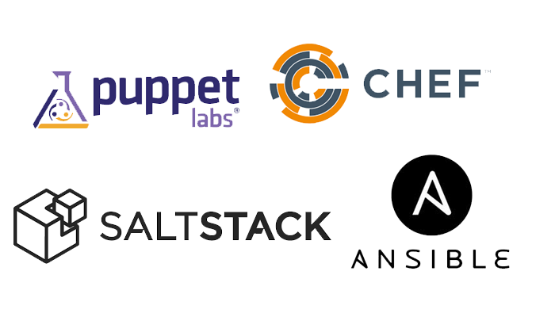
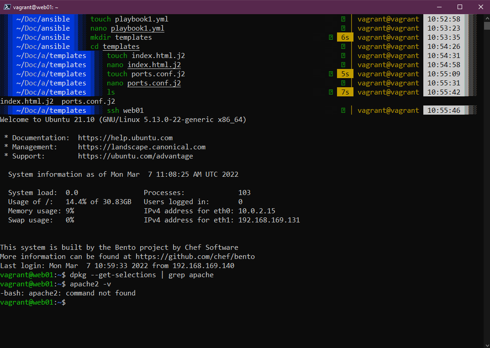

# learn-ansible
Ansible is an open-source automation tool used for configuration management, application deployment, and task automation.

## The Big Picture: Configuration Management

Configuration Management is the process of maintaining applications, systems and servers in the desired state. The overlap with Infrastructure as code is that IaC is going to make sure your infrastructure is at the desired state but after that especially terraform is not going to look after the desired state of your OS settings or Application and that is where Configuration Management tools come in. Make sure that the system and applications perform the way it is expected as changes occur over Deane.

Configuration management keeps you from making small or large changes that go undocumented.

### Scenario: Why would you want to use Configuration Management

What happens if their system fails, if there's a fire, a server goes down well? Dean knows exactly what to do he can fix that fire easily the problems become difficult for Dean however if multiple servers start failing particularly when you have large and expanding environments, this is why Dean needs to have a configuration management tool. Configuration Management tools can help make Dean look like a rockstar, all he has to do is configure the right codes that allow him to push out the instructions on how to set up each of the servers quickly effectively and at scale.

### Configuration Management tools

There are a variety of configuration management tools available, and each has specific features that make it better for some situations than others.



At this stage, we will take a quickfire look at the options in the above picture before making our choice on which one we will use and why.

- **Chef**

  - Chef ensures configuration is applied consistently in every environment, at any scale with infrastructure automation.
  - Chef is an open-source tool developed by OpsCode written in Ruby and Erlang.
  - Chef is best suited for organisations that have a heterogeneous infrastructure and are looking for mature solutions.
  - Recipes and Cookbooks determine the configuration code for your systems.
  - Pro - A large collection of recipes is available
  - Pro - Integrates well with Git which provides a strong version control
  - Con - Steep learning curve, a considerable amount of time required.
  - Con - The main server doesn't have much control.
  - Architecture - Server / Clients
  - Ease of setup - Moderate
  - Language - Procedural - Specify how to do a task

- **Puppet**
  - Puppet is a configuration management tool that supports automatic deployment.
  - Puppet is built in Ruby and uses DSL for writing manifests.
  - Puppet also works well with heterogeneous infrastructure where the focus is on scalability.
  - Pro - Large community for support.
  - Pro - Well-developed reporting mechanism.
  - Con - Advance tasks require knowledge of the Ruby language.
  - Con - The main server doesn't have much control.
  - Architecture - Server / Clients
  - Ease of setup - Moderate
  - Language - Declarative - Specify only what to do
- **Ansible**

  - Ansible is an IT automation tool that automates configuration management, cloud provisioning, deployment and orchestration.
  - The core of Ansible playbooks is written in YAML. (Should do a section on YAML as we have seen this a few times)
  - Ansible works well when there are environments that focus on getting things up and running fast.
  - Works on playbooks which provide instructions to your servers.
  - Pro - No agents are needed on remote nodes.
  - Pro - YAML is easy to learn.
  - Con - Performance speed is often less than other tools (Faster than doing it yourself manually)
  - Con - YAML is not as powerful as Ruby but has less of a learning curve.
  - Architecture - Client Only
  - Ease of setup - Very Easy
  - Language - Procedural - Specify how to do a task

- **SaltStack**
  - SaltStack is a CLI-based tool that automates configuration management and remote execution.
  - SaltStack is Python based whilst the instructions are written in YAML or its DSL.
  - Perfect for environments with scalability and resilience as the priority.
  - Pro - Easy to use when up and running
  - Pro - Good reporting mechanism
  - Con - The setup phase is tough
  - Con - New web UI which is much less developed than the others.
  - Architecture - Server / Clients
  - Ease of setup - Moderate
  - Language - Declarative - Specify only what to do

### Ansible vs Terraform

The tool that we will be using for this section is going to be Ansible. (Easy to use and easier language basics required.)

I think it is important to touch on some of the differences between Ansible and Terraform before we look into the tooling a little further.

|                | Ansible                                                      | Terraform                                                        |
| -------------- | ------------------------------------------------------------ | ---------------------------------------------------------------- |
| Type           | Ansible is a configuration management tool                   | Terraform is an orchestration tool                             |
| Infrastructure | Ansible provides support for mutable infrastructure          | Terraform provides support for immutable infrastructure          |
| Language       | Ansible follows procedural language                          | Terraform follows a declarative language                          |
| Provisioning   | Ansible provides partial provisioning (VM, Network, Storage) | Terraform provides extensive provisioning (VM, Network, Storage) |
| Packaging      | Ansible provides complete support for packaging & templating | Terraform provides partial support for packaging & templating    |
| Lifecycle Mgmt | Ansible does not have lifecycle management                   | Terraform is heavily dependent on lifecycle and state management  |

## Resources

- [What is Ansible](https://www.youtube.com/watch?v=1id6ERvfozo)
- [Ansible 101 - Episode 1 - Introduction to Ansible](https://www.youtube.com/watch?v=goclfp6a2IQ)
- [NetworkChuck - You need to learn Ansible right now!](https://www.youtube.com/watch?v=5hycyr-8EKs&t=955s)

## Ansible: Getting Started

Firstly Ansible comes from RedHat. Secondly, it is agentless, connects via SSH and runs commands. Thirdly it is cross-platform (Linux & macOS, WSL2) and open-source (there is also a paid-for enterprise option) Ansible pushes configuration vs other models.

### Ansible Installation

As you might imagine, RedHat and the Ansible team have done a fantastic job of documenting Ansible. This generally starts with the installation steps which you can find [here](https://docs.ansible.com/ansible/latest/installation_guide/intro_installation.html) Remember we said that Ansible is an agentless automation tool, the tool is deployed to a system referred to as a "Control Node" from this control node is manages machines and other devices (possibly network) over SSH.

It does state in the above-linked documentation that the Windows OS cannot be used as the control node.

For my control node and at least this demo, I am going to use the Ubuntu 22.04 Server run in Wsl as my control node.

This system was running Ubuntu and the installation steps simply need the following commands.

```Shell
sudo apt update
sudo apt install software-properties-common
sudo add-apt-repository --yes --update ppa:ansible/ansible
sudo apt install ansible
```

Now we should have ansible installed on our control node, you can check this by running `ansible --version` and you should see something similar to this below.


Before we then start to look at controlling other nodes in our environment, we can also check the functionality of ansible by running a command against our local machine `ansible localhost -m ping` will use an [Ansible Module](https://docs.ansible.com/ansible/2.9/user_guide/modules_intro.html) and this is a quick way to perform a single task across many different systems. I mean it is not much fun with just the local host but imagines you wanted to get something or make sure all your systems were up and you had 1000+ servers and devices.


Or an actual real-life use for a module might be something like `ansible webservers -m service -a "name=httpd state=started"` this will tell us if all of our webservers have the httpd service running. I have glossed over the webservers term used in that command.

### hosts

The way I used localhost above to run a simple ping module against the system, I cannot specify another machine on my network, for example in the environment I am using my Windows host where VirtualBox is running has a network adapter with the IP 10.0.0.1 but you can see below that I can reach by pinging but I cannot use ansible to perform that task.


For us to specify our hosts or the nodes that we want to automate with these tasks, we need to define them. We can define them by navigating to the /etc/ansible directory on your system.


The file we want to edit is the host's file, using a text editor we can jump in and define our hosts. The host file contains lots of great instructions on how to use and modify the file. We want to scroll down to the bottom and we are going to create a new group called [windows] and we are going to add our `10.0.0.1` IP address for that host. Save the file.


However, remember I said you will need to have SSH available to enable Ansible to connect to your system. As you can see below when I run `ansible windows -m ping` we get an unreachable because things failed to connect via SSH.

Step 1: Configure WinRM on the Target Windows Host (10.0.0.1)
1. Open PowerShell as Administrator on the target Windows host (`10.0.0.1`).
2. Enable WinRM:
```powershell
winrm quickconfig
```
- Press `Y` to confirm if prompted.

- Allow connection:
```powershell
Set-Item WSMan:\localhost\Service\Auth\Basic -Value $true
Set-Item WSMan:\localhost\Service\AllowUnencrypted -Value $true
```
1. Fix Network Category (if Public):
- Check network profile:
```powershell
Get-NetConnectionProfile
```
- If `NetworkCategory` is `Public`, change it to `Private` (replace `Wi-Fi` with your interface name):
```powershell
Set-NetConnectionProfile -InterfaceAlias "Wi-Fi" -NetworkCategory Private
```
- Verify:
```powershell
Get-NetConnectionProfile
```
1. Re-run WinRM Configuration:
```powershell
winrm quickconfig
```
1. Allow Basic Authentication and Unencrypted Traffic (for testing):
```powershell
Set-Item WSMan:\localhost\Service\Auth\Basic -Value $true
Set-Item WSMan:\localhost\Service\AllowUnencrypted -Value $true
```
1. Open WinRM Port in Firewall:
```powershell
New-NetFirewallRule -Name "WinRM HTTP" -DisplayName "WinRM HTTP" -Enabled True -Direction Inbound -Protocol TCP -Action Allow -LocalPort 5985
```
1. Verify WinRM:
```powershell
winrm enumerate winrm/config/listener
```
- Ensure a listener is running on port 5985 (HTTP).
Step 2: Configure Ansible Inventory
1. Navigate to Ansible Directory in WSL:
```bash
cd /etc/ansible
```
1. Edit the Default Inventory File:
- Open the hosts file:
```bash
sudo nano /etc/ansible/hosts
```
- Add the following at the bottom:
```ini
[windows]
10.0.0.1 ansible_connection=winrm ansible_user=Administrator ansible_password=YourPassword ansible_winrm_transport=basic ansible_winrm_port=5985 ansible_winrm_scheme=http
```
- Replace `YourPassword` with the actual password for the `Administrator` account on `10.0.0.1`.
- Save and exit (Ctrl+O, Enter, Ctrl+X).
1. Alternative: Use a Custom Inventory File:
- Create a directory and file:
```bash
mkdir -p ~/ansible
nano ~/ansible/inventory.ini
```
- Add the same content:
```ini
[windows]
10.0.0.1 ansible_connection=winrm ansible_user=Administrator ansible_password=YourPassword ansible_winrm_transport=basic ansible_winrm_port=5985 ansible_winrm_scheme=http
```
- Save and exit.
Step 3: Test the Connection with Ansible
1. Run the `win_ping` Module:
- Using the default inventory:
```bash
ansible windows -m win_ping
```
- Or using the custom inventory:
```bash
ansible -i ~/ansible/inventory.ini windows -m win_ping
```
1. Expected Output:
```text
10.0.0.1 | SUCCESS => {
    "changed": false,
    "ping": "pong"
}
```


I have now also started adding some additional hosts to our inventory, another name for this file as this is where you are going to define all of your devices, could be network devices, switches and routers for example also would be added here and grouped. In our hosts file though I have also added my credentials for accessing the Linux group of systems.


Now if we run `ansible Linux -m ping` we get success as per below.


We then have the node requirements, these are the target systems you wish to automate the configuration on. We are not installing anything for Ansible on these (I mean we might be installing software but there is no client from Ansible we need) Ansible will make a connection over SSH and send anything over SFTP. (If you so desire though and you have SSH configured you could use SCP vs SFTP.)

### Ansible Commands

You saw that we were able to run `ansible Linux -m ping` against our Linux machine and get a response, basically, with Ansible we can run many ad-hoc commands. But you can run this against a group of systems and get that information back. [ad hoc commands](https://docs.ansible.com/ansible/latest/user_guide/intro_adhoc.html)

If you find yourself repeating commands or even worse you are having to log into individual systems to run these commands then Ansible can help there. For example, the simple command below would give us the output of all the operating system details for all of the systems we add to our Linux group.
`ansible linux -a "cat /etc/os-release"`

Other use cases could be to reboot systems, copy files, and manage packers and users. You can also couple ad hoc commands with Ansible modules.

Ad hoc commands use a declarative model, calculating and executing the actions required to reach a specified final state. They achieve a form of idempotence by checking the current state before they begin and doing nothing unless the current state is different from the specified final state.

## Resources

- [What is Ansible](https://www.youtube.com/watch?v=1id6ERvfozo)
- [Ansible 101 - Episode 1 - Introduction to Ansible](https://www.youtube.com/watch?v=goclfp6a2IQ)
- [NetworkChuck - You need to learn Ansible right now!](https://www.youtube.com/watch?v=5hycyr-8EKs&t=955s)

### Ansible Playbooks

In this section we will take a look at the main reason that I can see at least for Ansible, I mean it is great to take a single command and hit many different servers to perform simple commands such as rebooting a long list of servers and saving the hassle of having to connect to each one individually.

But what about actually taking a bare operating system and declaring the software and services we want running on that system and making sure they are all running in that desired state.

This is where ansible playbooks come in. A playbook enables us to take our group of servers and perform configuration and installation tasks against that group.

### Playbook format

Playbook > Plays > Tasks

For anyone that comes from a sports background you may have come across the term playbook, a playbook then tells the team how you will play made up of various plays and tasks if we think of the plays as the set pieces within the sport or game, and the tasks are associated to each play, you can have multiple tasks to make up a play and in the playbook, you may have multiple different plays.

These playbooks are written in YAML (YAML ain’t markup language) you will find a lot of the sections we have covered so far especially Containers and Kubernetes to feature YAML formatted configuration files.

Let’s take a look at a simple playbook called playbook.yml.

```Yaml
- name: Simple Play
  hosts: localhost
  connection: local
  tasks:
    - name: Ping me
      ping:
    - name: print os
      debug:
        msg: "{{ ansible_os_family }}"
```

You will find the above file [simple_play](days/../Configmgmt/simple_play.yml). If we then use the `ansible-playbook simple_play.yml` command we will walk through the following steps.


You can see the first task of "gathering steps" happened, but we didn't trigger or ask for this? This module is automatically called by playbooks to gather useful variables about remote hosts. [ansible.builtin.setup](https://docs.ansible.com/ansible/latest/collections/ansible/builtin/setup_module.html)

Our second task was to set a ping, this is not an ICMP ping but a python script to report back `pong` on successful connectivity to remote or localhost. [ansible.builtin.ping](https://docs.ansible.com/ansible/latest/collections/ansible/builtin/ping_module.html)

Then our third or our second defined task as the first one will run unless you disable was the printing of a message telling us our OS. In this task we are using conditionals, we could run this playbook against all different types of operating systems and this would return the OS name. We are simply messaging this output for ease but we could add a task to say something like:

```Yaml
tasks:
  - name: "shut down Debian flavoured systems"
    command: /sbin/shutdown -t now
    when: ansible_os_family == "Debian"
```

### Vagrant to set up our environment

We are going to use Vagrant to set up our node environment, I am going to keep this at a reasonable 4 nodes but you can hopefully see that this could easily be 300 or 3000 and this is the power of Ansible and other configuration management tools to be able to configure your servers.

You can find this file located here ([Vagrantfile](Configmgmt/Vagrantfile))

```Vagrant
Vagrant.configure("2") do |config|
  # Define the servers with updated box and resource tweaks
  servers = [
    {
      :hostname => "db01",
      :box => "bento/ubuntu-22.04", # Updated to LTS version
      :ip => "192.168.169.130",
      :ssh_port => "2210",
      :memory => 4096, # Increased for DB workload
      :cpus => 2
    },
    {
      :hostname => "web01",
      :box => "bento/ubuntu-22.04",
      :ip => "192.168.169.131",
      :ssh_port => "2211",
      :memory => 2048,
      :cpus => 1
    },
    {
      :hostname => "web02",
      :box => "bento/ubuntu-22.04",
      :ip => "192.168.169.132",
      :ssh_port => "2212",
      :memory => 2048,
      :cpus => 1
    },
    {
      :hostname => "loadbalancer",
      :box => "bento/ubuntu-22.04",
      :ip => "192.168.169.134",
      :ssh_port => "2213",
      :memory => 2048,
      :cpus => 1
    }
  ]

  # Iterate over each server configuration
  servers.each do |machine|
    config.vm.define machine[:hostname] do |node|
      # Base configuration
      node.vm.box = machine[:box]
      node.vm.hostname = machine[:hostname]

      # Network configuration (bridged with dynamic interface selection)
      node.vm.network "public_network", ip: machine[:ip], bridge: nil # Prompts for interface
      node.vm.network "forwarded_port", guest: 22, host: machine[:ssh_port], id: "ssh"

      # VirtualBox provider settings
      node.vm.provider "virtualbox" do |vb|
        vb.name = machine[:hostname]
        vb.memory = machine[:memory]
        vb.cpus = machine[:cpus]
        vb.customize ["modifyvm", :id, "--natdnshostresolver1", "on"] # Improve DNS resolution
      end

      # Optional provisioning (example: install basic tools)
      node.vm.provision "shell", inline: <<-SHELL
        sudo apt-get update
        sudo apt-get install -y curl net-tools
        echo "VM #{machine[:hostname]} provisioned successfully" > /home/vagrant/provision.log
      SHELL
    end
  end
end
```

Use the `vagrant up` command to spin these machines up in VirtualBox, You might be able to add more memory and you might also want to define a different private_network address for each machine but this works in my environment. Remember our control box is the Ubuntu desktop we deployed during the Linux section.

If you are resource contrained then you can also run `vagrant up web01 web02` to only bring up the webservers that we are using here.

### Ansible host configuration

Now that we have our environment ready, we can check ansible and for this, we will use our Ubuntu desktop (You could use this but you can equally use any Linux-based machine on your network access to the network below) as our control, let’s also add the new nodes to our group in the ansible hosts file, you can think of this file as an inventory, an alternative to this could be another inventory file that is called on as part of your ansible command with `-i filename` this could be useful vs using the host file as you can have different files for different environments, maybe production, test and staging. Because we are using the default hosts file we do not need to specify as this would be the default used.

I have added the following to the default hosts file.

```Text
[control]
ansible-control

[proxy]
loadbalancer

[webservers]
web01
web02

[database]
db01
```


Before moving on we want to make sure we can run a command against our nodes, let’s run `ansible nodes -m command -a hostname` this simple command will test that we have connectivity and report back our host names.

Also, note that I have added these nodes and IPs to my Ubuntu control node within the /etc/hosts file to ensure connectivity. We might also need to do an SSH configuration for each node from the Ubuntu box.

```Text
192.168.169.140 ansible-control
192.168.169.130 db01
192.168.169.131 web01
192.168.169.132 web02
192.168.169.133 loadbalancer
```


At this stage, we want to run through setting up SSH keys between your control and your server nodes. This is what we are going to do next, another way here could be to add variables into your host's file to give username and password. I would advise against this as this is never going to be a best practice.

To set up SSH and share amongst your nodes, follow the steps below, you will be prompted for passwords (`vagrant`) and you will likely need to hit `y` a few times to accept.

`ssh-keygen`


`ssh-copy-id localhost`


Now if you have all of your VMs switched on then you can run the `ssh-copy-id web01 && ssh-copy-id web02 && ssh-copy-id loadbalancer && ssh-copy-id db01` this will prompt you for your password in our case our password is `vagrant`

I am not running all my VMs and only running the webservers so I issued `ssh-copy-id web01 && ssh-copy-id web02`


Before running any playbooks I like to make sure that I have simple connectivity with my groups so I have run `ansible webservers -m ping` to test connectivity.


### Our First "real" Ansible Playbook

Our first Ansible playbook is going to configure our web servers, we have grouped these in our host's file under the grouping [webservers].

Before we run our playbook we can confirm that our web01 and web02 do not have apache installed. The top of the screenshot below is showing you the folder and file layout I have created within my ansible control to run this playbook, we have the `playbook1.yml`, then in the templates folder we have the `index.html.j2` and `ports.conf.j2` files. You can find these files in the folder listed above in the repository.

Then we SSH into web01 to check if we have apache installed?



You can see from the above that we have not got apache installed on our web01 so we can fix this by running the below playbook.

```Yaml
- hosts: webservers
  become: yes
  vars:
    http_port: 8000
    https_port: 4443
    html_welcome_msg: "Hello Guys, Welcome to Ansible Automation"
  tasks:
  - name: ensure apache is at the latest version
    apt:
      name: apache2
      state: latest

  - name: write the apache2 ports.conf config file
    template:
      src: templates/ports.conf.j2
      dest: /etc/apache2/ports.conf
    notify:
    - restart apache

  - name: write a basic index.html file
    template:
      src: templates/index.html.j2
      dest: /var/www/html/index.html
    notify:
    - restart apache

  - name: ensure apache is running
    service:
      name: apache2
      state: started

  handlers:
    - name: restart apache
      service:
        name: apache2
        state: restarted
```

Breaking down the above playbook:

- `- hosts: webservers` this is saying that our group to run this playbook on is a group called webservers
- `become: yes` means that our user running the playbook will become root on our remote systems. You will be prompted for the root password.
- We then have `vars` and this defines some environment variables we want throughout our webservers.

Following this, we start our tasks,

- Task 1 is to ensure that apache is running the latest version
- Task 2 is writing the ports.conf file from our source found in the templates folder.
- Task 3 is creating a basic index.html file
- Task 4 is making sure apache is running

Finally, we have a handlers section, [Handlers: Running operations on change](https://docs.ansible.com/ansible/latest/user_guide/playbooks_handlers.html)

"Sometimes you want a task to run only when a change is made on a machine. For example, you may want to restart a service if a task updates the configuration of that service, but not if the configuration is unchanged. Ansible uses handlers to address this use case. Handlers are tasks that only run when notified. Each handler should have a globally unique name."

At this stage, you might be thinking that we have deployed 5 VMs (including our Ubuntu Desktop machine which is acting as our Ansible Control) The other systems will come into play during the rest of the section.

### Run our Playbook

We are now ready to run our playbook against our nodes. To run our playbook we can use the `ansible-playbook playbook1.yml` We have defined the hosts that our playbook will run against within the playbook and this will walk through the tasks that we have defined.

When the command is complete we get an output showing our plays and tasks, this may take some time you can see from the below image that this took a while to go and install our desired state.


We can then double-check this by jumping into a node and checking we have the installed software on our node.


Just to round this out as we have deployed two standalone webservers with the above we can now navigate to the respective IPs that we defined and get our new website.


We are going to build on this playbook as we move through the rest of this section. I am interested as well in taking our Ubuntu desktop and seeing if we could bootstrap our applications and configuration using Ansible so we might also touch this. You saw that we can use the local host in our commands we can also run playbooks against our local host for example.

Another thing to add here is that we are only really working with Ubuntu VMs but Ansible is agnostic to the target systems. The alternatives that we have previously mentioned to manage your systems could be server by server (not scalable when you get over a large number of servers, plus a pain even with 3 nodes) we can also use shell scripting which again we covered in the Linux section but these nodes are potentially different so yes it can be done but then someone needs to maintain and manage those scripts. Ansible is free and hits the easy button vs having to have a specialised script.

## Resources

- [What is Ansible](https://www.youtube.com/watch?v=1id6ERvfozo)
- [Ansible 101 - Episode 1 - Introduction to Ansible](https://www.youtube.com/watch?v=goclfp6a2IQ)
- [NetworkChuck - You need to learn Ansible right now!](https://www.youtube.com/watch?v=5hycyr-8EKs&t=955s)
- [Your complete guide to Ansible](https://www.youtube.com/playlist?list=PLnFWJCugpwfzTlIJ-JtuATD2MBBD7_m3u)

This final playlist listed above is where a lot of the code and ideas came from for this section, a great resource and walkthrough in video format.