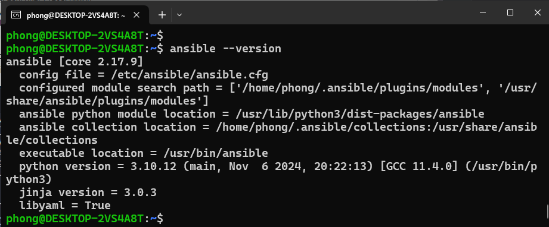

# learn-ansible
Ansible is an open-source automation tool used for configuration management, application deployment, and task automation.

## The Big Picture: Configuration Management

Configuration Management is the process of maintaining applications, systems and servers in the desired state. The overlap with Infrastructure as code is that IaC is going to make sure your infrastructure is at the desired state but after that especially terraform is not going to look after the desired state of your OS settings or Application and that is where Configuration Management tools come in. Make sure that the system and applications perform the way it is expected as changes occur over Deane.

Configuration management keeps you from making small or large changes that go undocumented.

### Scenario: Why would you want to use Configuration Management

What happens if their system fails, if there's a fire, a server goes down well? Dean knows exactly what to do he can fix that fire easily the problems become difficult for Dean however if multiple servers start failing particularly when you have large and expanding environments, this is why Dean needs to have a configuration management tool. Configuration Management tools can help make Dean look like a rockstar, all he has to do is configure the right codes that allow him to push out the instructions on how to set up each of the servers quickly effectively and at scale.

### Configuration Management tools

There are a variety of configuration management tools available, and each has specific features that make it better for some situations than others.


At this stage, we will take a quickfire look at the options in the above picture before making our choice on which one we will use and why.

- **Chef**

  - Chef ensures configuration is applied consistently in every environment, at any scale with infrastructure automation.
  - Chef is an open-source tool developed by OpsCode written in Ruby and Erlang.
  - Chef is best suited for organisations that have a heterogeneous infrastructure and are looking for mature solutions.
  - Recipes and Cookbooks determine the configuration code for your systems.
  - Pro - A large collection of recipes is available
  - Pro - Integrates well with Git which provides a strong version control
  - Con - Steep learning curve, a considerable amount of time required.
  - Con - The main server doesn't have much control.
  - Architecture - Server / Clients
  - Ease of setup - Moderate
  - Language - Procedural - Specify how to do a task

- **Puppet**
  - Puppet is a configuration management tool that supports automatic deployment.
  - Puppet is built in Ruby and uses DSL for writing manifests.
  - Puppet also works well with heterogeneous infrastructure where the focus is on scalability.
  - Pro - Large community for support.
  - Pro - Well-developed reporting mechanism.
  - Con - Advance tasks require knowledge of the Ruby language.
  - Con - The main server doesn't have much control.
  - Architecture - Server / Clients
  - Ease of setup - Moderate
  - Language - Declarative - Specify only what to do
- **Ansible**

  - Ansible is an IT automation tool that automates configuration management, cloud provisioning, deployment and orchestration.
  - The core of Ansible playbooks is written in YAML. (Should do a section on YAML as we have seen this a few times)
  - Ansible works well when there are environments that focus on getting things up and running fast.
  - Works on playbooks which provide instructions to your servers.
  - Pro - No agents are needed on remote nodes.
  - Pro - YAML is easy to learn.
  - Con - Performance speed is often less than other tools (Faster than doing it yourself manually)
  - Con - YAML is not as powerful as Ruby but has less of a learning curve.
  - Architecture - Client Only
  - Ease of setup - Very Easy
  - Language - Procedural - Specify how to do a task

- **SaltStack**
  - SaltStack is a CLI-based tool that automates configuration management and remote execution.
  - SaltStack is Python based whilst the instructions are written in YAML or its DSL.
  - Perfect for environments with scalability and resilience as the priority.
  - Pro - Easy to use when up and running
  - Pro - Good reporting mechanism
  - Con - The setup phase is tough
  - Con - New web UI which is much less developed than the others.
  - Architecture - Server / Clients
  - Ease of setup - Moderate
  - Language - Declarative - Specify only what to do

### Ansible vs Terraform

The tool that we will be using for this section is going to be Ansible. (Easy to use and easier language basics required.)

I think it is important to touch on some of the differences between Ansible and Terraform before we look into the tooling a little further.

|                | Ansible                                                      | Terraform                                                        |
| -------------- | ------------------------------------------------------------ | ---------------------------------------------------------------- |
| Type           | Ansible is a configuration management tool                   | Terraform is an orchestration tool                             |
| Infrastructure | Ansible provides support for mutable infrastructure          | Terraform provides support for immutable infrastructure          |
| Language       | Ansible follows procedural language                          | Terraform follows a declarative language                          |
| Provisioning   | Ansible provides partial provisioning (VM, Network, Storage) | Terraform provides extensive provisioning (VM, Network, Storage) |
| Packaging      | Ansible provides complete support for packaging & templating | Terraform provides partial support for packaging & templating    |
| Lifecycle Mgmt | Ansible does not have lifecycle management                   | Terraform is heavily dependent on lifecycle and state management  |

## Resources

- [What is Ansible](https://www.youtube.com/watch?v=1id6ERvfozo)
- [Ansible 101 - Episode 1 - Introduction to Ansible](https://www.youtube.com/watch?v=goclfp6a2IQ)
- [NetworkChuck - You need to learn Ansible right now!](https://www.youtube.com/watch?v=5hycyr-8EKs&t=955s)

## Ansible: Getting Started

Firstly Ansible comes from RedHat. Secondly, it is agentless, connects via SSH and runs commands. Thirdly it is cross-platform (Linux & macOS, WSL2) and open-source (there is also a paid-for enterprise option) Ansible pushes configuration vs other models.

### Ansible Installation

As you might imagine, RedHat and the Ansible team have done a fantastic job of documenting Ansible. This generally starts with the installation steps which you can find [here](https://docs.ansible.com/ansible/latest/installation_guide/intro_installation.html) Remember we said that Ansible is an agentless automation tool, the tool is deployed to a system referred to as a "Control Node" from this control node is manages machines and other devices (possibly network) over SSH.

It does state in the above-linked documentation that the Windows OS cannot be used as the control node.

For my control node and at least this demo, I am going to use the Ubuntu 22.04 Server run in Wsl as my control node.

This system was running Ubuntu and the installation steps simply need the following commands.

```Shell
sudo apt update
sudo apt install software-properties-common
sudo add-apt-repository --yes --update ppa:ansible/ansible
sudo apt install ansible
```

Now we should have ansible installed on our control node, you can check this by running `ansible --version` and you should see something similar to this below.



Before we then start to look at controlling other nodes in our environment, we can also check the functionality of ansible by running a command against our local machine `ansible localhost -m ping` will use an [Ansible Module](https://docs.ansible.com/ansible/2.9/user_guide/modules_intro.html) and this is a quick way to perform a single task across many different systems. I mean it is not much fun with just the local host but imagines you wanted to get something or make sure all your systems were up and you had 1000+ servers and devices.


Or an actual real-life use for a module might be something like `ansible webservers -m service -a "name=httpd state=started"` this will tell us if all of our webservers have the httpd service running. I have glossed over the webservers term used in that command.

### hosts

The way I used localhost above to run a simple ping module against the system, I cannot specify another machine on my network, for example in the environment I am using my Windows host where VirtualBox is running has a network adapter with the IP 10.0.0.1 but you can see below that I can reach by pinging but I cannot use ansible to perform that task.


For us to specify our hosts or the nodes that we want to automate with these tasks, we need to define them. We can define them by navigating to the /etc/ansible directory on your system.


The file we want to edit is the host's file, using a text editor we can jump in and define our hosts. The host file contains lots of great instructions on how to use and modify the file. We want to scroll down to the bottom and we are going to create a new group called [windows] and we are going to add our `10.0.0.1` IP address for that host. Save the file.


However, remember I said you will need to have SSH available to enable Ansible to connect to your system. As you can see below when I run `ansible windows -m ping` we get an unreachable because things failed to connect via SSH.

Step 1: Configure WinRM on the Target Windows Host (10.0.0.1)
1. Open PowerShell as Administrator on the target Windows host (`10.0.0.1`).
2. Enable WinRM:
```powershell
winrm quickconfig
```
- Press `Y` to confirm if prompted.

- Allow connection:
```powershell
Set-Item WSMan:\localhost\Service\Auth\Basic -Value $true
Set-Item WSMan:\localhost\Service\AllowUnencrypted -Value $true
```
1. Fix Network Category (if Public):
- Check network profile:
```powershell
Get-NetConnectionProfile
```
- If `NetworkCategory` is `Public`, change it to `Private` (replace `Wi-Fi` with your interface name):
```powershell
Set-NetConnectionProfile -InterfaceAlias "Wi-Fi" -NetworkCategory Private
```
- Verify:
```powershell
Get-NetConnectionProfile
```
1. Re-run WinRM Configuration:
```powershell
winrm quickconfig
```
1. Allow Basic Authentication and Unencrypted Traffic (for testing):
```powershell
Set-Item WSMan:\localhost\Service\Auth\Basic -Value $true
Set-Item WSMan:\localhost\Service\AllowUnencrypted -Value $true
```
1. Open WinRM Port in Firewall:
```powershell
New-NetFirewallRule -Name "WinRM HTTP" -DisplayName "WinRM HTTP" -Enabled True -Direction Inbound -Protocol TCP -Action Allow -LocalPort 5985
```
1. Verify WinRM:
```powershell
winrm enumerate winrm/config/listener
```
- Ensure a listener is running on port 5985 (HTTP).
Step 2: Configure Ansible Inventory
1. Navigate to Ansible Directory in WSL:
```bash
cd /etc/ansible
```
1. Edit the Default Inventory File:
- Open the hosts file:
```bash
sudo nano /etc/ansible/hosts
```
- Add the following at the bottom:
```ini
[windows]
10.0.0.1 ansible_connection=winrm ansible_user=Administrator ansible_password=YourPassword ansible_winrm_transport=basic ansible_winrm_port=5985 ansible_winrm_scheme=http
```
- Replace `YourPassword` with the actual password for the `Administrator` account on `10.0.0.1`.
- Save and exit (Ctrl+O, Enter, Ctrl+X).
1. Alternative: Use a Custom Inventory File:
- Create a directory and file:
```bash
mkdir -p ~/ansible
nano ~/ansible/inventory.ini
```
- Add the same content:
```ini
[windows]
10.0.0.1 ansible_connection=winrm ansible_user=Administrator ansible_password=YourPassword ansible_winrm_transport=basic ansible_winrm_port=5985 ansible_winrm_scheme=http
```
- Save and exit.
Step 3: Test the Connection with Ansible
1. Run the `win_ping` Module:
- Using the default inventory:
```bash
ansible windows -m win_ping
```
- Or using the custom inventory:
```bash
ansible -i ~/ansible/inventory.ini windows -m win_ping
```
1. Expected Output:
```text
10.0.0.1 | SUCCESS => {
    "changed": false,
    "ping": "pong"
}
```


I have now also started adding some additional hosts to our inventory, another name for this file as this is where you are going to define all of your devices, could be network devices, switches and routers for example also would be added here and grouped. In our hosts file though I have also added my credentials for accessing the Linux group of systems.


Now if we run `ansible Linux -m ping` we get success as per below.


We then have the node requirements, these are the target systems you wish to automate the configuration on. We are not installing anything for Ansible on these (I mean we might be installing software but there is no client from Ansible we need) Ansible will make a connection over SSH and send anything over SFTP. (If you so desire though and you have SSH configured you could use SCP vs SFTP.)

### Ansible Commands

You saw that we were able to run `ansible Linux -m ping` against our Linux machine and get a response, basically, with Ansible we can run many ad-hoc commands. But you can run this against a group of systems and get that information back. [ad hoc commands](https://docs.ansible.com/ansible/latest/user_guide/intro_adhoc.html)

If you find yourself repeating commands or even worse you are having to log into individual systems to run these commands then Ansible can help there. For example, the simple command below would give us the output of all the operating system details for all of the systems we add to our Linux group.
`ansible linux -a "cat /etc/os-release"`

Other use cases could be to reboot systems, copy files, and manage packers and users. You can also couple ad hoc commands with Ansible modules.

Ad hoc commands use a declarative model, calculating and executing the actions required to reach a specified final state. They achieve a form of idempotence by checking the current state before they begin and doing nothing unless the current state is different from the specified final state.

## Resources

- [What is Ansible](https://www.youtube.com/watch?v=1id6ERvfozo)
- [Ansible 101 - Episode 1 - Introduction to Ansible](https://www.youtube.com/watch?v=goclfp6a2IQ)
- [NetworkChuck - You need to learn Ansible right now!](https://www.youtube.com/watch?v=5hycyr-8EKs&t=955s)